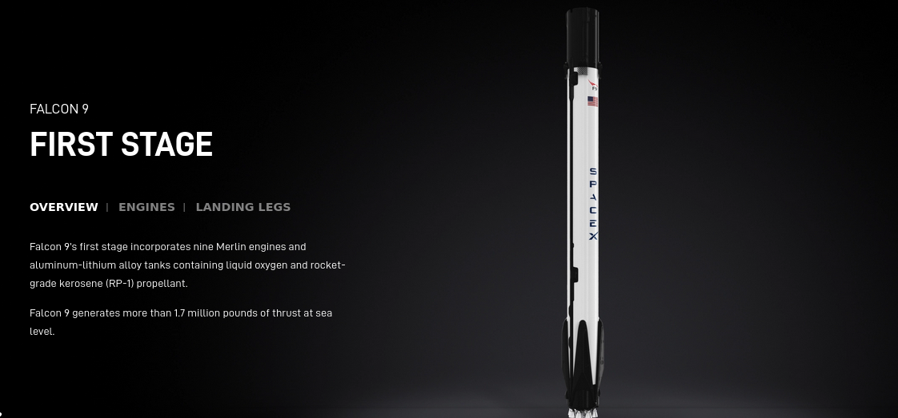
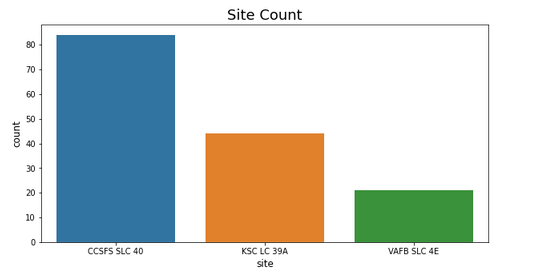
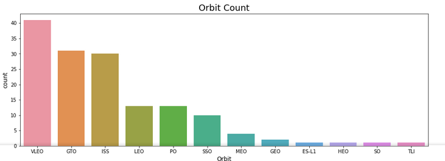
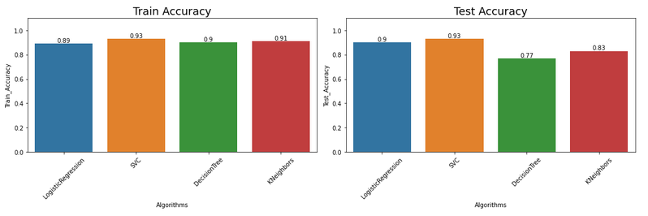
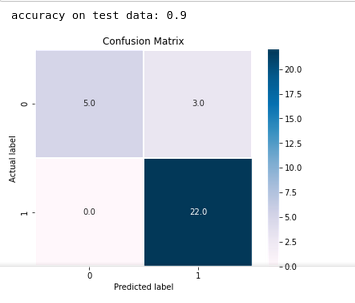

# PREDICTING SPACE-X FALCON 9 ROCKET LAUCHE

## Bussiness Problem.
Space X advertises Falcon 9 rocket on it website, with a cost of 62 million dollars; other provider cost upward of 165 million dollar each, much of the saving is because Space X can reuse the first stage. Therefore, if we can determine the success the first stage, we can determine the cost of a launch. This information can be used if an alternate company wants to be bid against Space X for a rocket launch.
| Success     	            | Failure 	        |
|-------------------	    |------------------	|
|   	|

        |
## Data Source.
Dataset used in these notebook were;
- Pulled from Space-X API.
- Scraped from wikipeadia.
- 
## Quick Glance At Result

